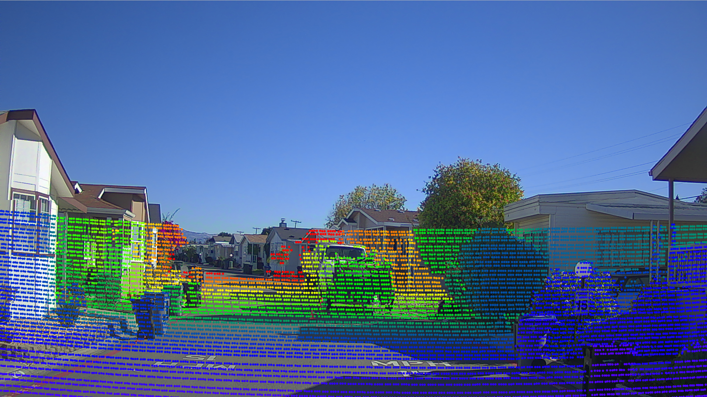

# Apollo 2.0 传感器标定方法使用指南

欢迎使用Apollo传感器标定服务。本文档提供在Apollo 2.0中新增的3项传感器标定程序的使用流程说明，分别为：相机到相机的标定，相机到多线激光雷达的标定，以及毫米波雷达到相机的标定。

## 文档概览

* 概述
* 准备工作
* 标定流程
* 标定结果获取
* 标定结果验证

## 概述

在Apollo 2.0中，我们新增了3项标定功能：相机到相机的标定，相机到多线激光雷达的标定，以及毫米波雷达到相机的标定。对于多线激光雷达到组合惯导的标定，请参考多线激光雷达-组合惯导标定说明。Velodyne HDL64用户还可以使用Apollo 1.5提供的标定服务平台。标定工具均以车载可执行程序的方式提供。用户仅需要启动相应的标定程序，即可实时完成标定工作并进行结果验证。标定结果以 `.yaml` 文件形式返回。

## 准备工作

1. 下载[标定工具](https://github.com/ApolloAuto/apollo/releases/download/v2.0.0/calibration.tar.gz)，并解压缩到`$APOLLO_HOME/modules/calibration`目录下。（APOLLO_HOME是apollo代码的根目录）

2. 相机内参文件

	内参包含相机的焦距、主点和畸变系数等信息，可以通过一些成熟的相机标定工具来获得，例如 [ROS Camera Calibration Tools](http://wiki.ros.org/camera_calibration/Tutorials/MonocularCalibration) 和 [Camera Calibration Toolbox for Matlab](http://www.vision.caltech.edu/bouguetj/calib_doc/)。内参标定完成后，需将结果转换为 `.yaml` 格式的文件。下面是一个正确的内参文件样例：

	```bash
	header: 
	  seq: 0
	  stamp: 
	    secs: 0
	    nsecs: 0
	  frame_id: short_camera
	height: 1080
	width: 1920
	distortion_model: plumb_bob
	D: [-0.535253, 0.259291, 0.004276, -0.000503, 0.0]
	K: [1959.678185, 0.0, 1003.592207, 0.0, 1953.786100, 507.820634, 0.0, 0.0, 1.0]
	R: [1.0, 0.0, 0.0, 0.0, 1.0, 0.0, 0.0, 0.0, 1.0]
	P: [1665.387817, 0.0, 1018.703332, 0.0, 0.0, 1867.912842, 506.628623, 0.0, 0.0, 0.0, 1.0, 0.0]
	binning_x: 0
	binning_y: 0
	roi: 
	  x_offset: 0
	  y_offset: 0
	  height: 0
	  width: 0
	  do_rectify: False
	```

	我们建议每一只相机都需要单独进行内参标定，而不是使用统一的内参结果。这样可以提高外参标定的准确性。

3. 初始外参文件

	本工具需要用户提供初始的外参值作为参考。一个良好的初始值可以帮助算法得到更精确的结果。下面是一个正确的相机到激光雷达的初始外参文件样例，其中translation为相机相对激光雷达的平移距离关系，rotation为旋转矩阵的四元数表达形式：

	```bash
	header:
	  seq: 0
	  stamp:
	    secs: 0
	    nsecs: 0
	  frame_id: velodyne64
	child_frame_id: short_camera
	transform:
	  rotation:
	    y: 0.5
	    x: -0.5
	    w: 0.5
	    z: -0.5
	  translation:
	    x: 0.0
	    y: 1.5
	    z: 2.0
	```

	注意：相机到激光雷达的标定方法比较依赖于初始外参值的选取，一个偏差较大的外参，有可能导致标定失败。所以，请在条件允许的情况下，尽可能提供更加精准的初始外参值。

4. 标定场地

	我们的标定方法是基于自然场景的，所以一个理想的标定场地可以显著地提高标定结果的准确度。我们建议选取一个纹理丰富的场地，如有树木，电线杆，路灯，交通标志牌，静止的物体和清晰车道线。图1是一个较好的标定环境示例：

	
	<p align="center"> 图1 一个良好的标定场地 </p>

5. 所需Topics
	
	确认程序所需传感器数据的topics均有输出。如何查看传感器有数据输出？

	各个程序所需的topics如下表1-表3所示：
	
	表1. 相机到相机标定所需topics

	| 传感器       | Topic名称                                 |Topic发送频率（Hz）|
	| ------------ | ----------------------------------------- | ----------------- |
	| Short_Camera | /apollo/sensor/camera/traffic/image_short | 9                 |
	| Long_Camera  | /apollo/sensor/camera/traffic/image_long  | 9                 |
	| INS          | /apollo/sensor/gnss/odometry              | 100               |
	| INS          | /apollo/sensor/gnss/ins_stat              | 2                 |

	表2. 相机到64线激光雷达标定所需topics

	| 传感器       | Topic名称                                 |Topic发送频率（Hz）|
	| ------------ | ----------------------------------------- | ----------------- |
	| Short_Camera | /apollo/sensor/camera/traffic/image_short | 9                 |
	| LiDAR  | /apollo/sensor/velodyne64/compensator/PointCloud2  | 10                |
	| INS          | /apollo/sensor/gnss/odometry              | 100               |
	| INS          | /apollo/sensor/gnss/ins_stat              | 2                 |
	
	表3. 毫米波雷达到相机标定所需topics

	| 传感器       | Topic名称                                 |Topic发送频率（Hz）|
	| ------------ | ----------------------------------------- | ----------------- |
	| Short_Camera | /apollo/sensor/camera/traffic/image_short | 9                 |
	| INS          | /apollo/sensor/gnss/odometry              | 100               |
	| INS          | /apollo/sensor/gnss/ins_stat              | 2                 |

## 标定流程

所有标定程序需要用到车辆的定位结果。请确认车辆定位状态为56，否则标定程序不会开始采集数据。输入以下命令可查询车辆定位状态：

```bash
	rostopic echo /apollo/sensor/gnss/ins_stat
    ```

### 相机到相机

1. 运行方法

	使用以下命令来启动标定工具：
	
	```bash
	cd /apollo/scripts
	bash sensor_calibration.sh camera_camera
	```

2. 采集标定数据
	* 由于两个相机的成像时间无法完全同步，所以在录制数据的时候，尽量将车辆进行慢速行驶，可以有效地缓解因时间差异所引起的图像不匹配问题。
	* 两个相机需有尽量大的图像重叠区域，否则该工具将无法进行外参标定运算。

3. 配置参数

	配置文件保存在以下路径，详细说明请参照表4。
	
	```bash
	/apollo/modules/calibration/camera_camera_calibrator/conf/camera_camera_calibrtor.conf
	```

	表4. 相机到相机标定程序配置项说明
	
	|配置项             | 说明               |
	|----------------- | ----------------  |
	|long_image_topic  | 长焦相机的图像topic |
	|short_image_topic | 广角相机的图像topic |
	|odometry_topic    | 车辆定位topic      |
	|ins_stat_topic    | 车辆定位状态topic   |
	|long_camera_intrinsics_filename  | 长焦相机的内参文件路径  |
	|short_camera_intrinsics_filename | 广角相机的内参文件路径  |
	|init_extrinsics_filename | 初始外参文件路径  |
	|output_path	   | 标定结果输出路径    |
	|max_speed_kmh     | 最大车速限制，单位km/h  |

4. 输出内容

	* 外参文件： 长焦相机到广角相机的外参文件。
	* 验证参考图片：包括一张长焦相机图像、一张广角相机图像及一张长焦相机依据标定后的外参投影到广角相机的去畸变融合图像。

### 相机到多线激光雷达

1. 运行方法

	使用以下命令来启动标定工具：
	
	```bash
	cd /apollo/scripts
	bash sensor_calibration.sh lidar_camera
	```

2. 采集标定数据
	* 为避免时间戳不同步，在录制数据的时候，尽量将车辆进行慢速行驶，可以有效地缓解因时间差异所引起的标定问题。
	* 相机中需看到一定数量的投影点云，否则该工具将无法进行外参标定运算。因此，我们建议使用短焦距相机来进行相机-激光雷达的标定。

3. 配置参数

	配置文件保存在以下路径，详细说明请参照表5。
	
	```bash
	/apollo/modules/calibration/lidar_camera_calibrator/conf/lidar_camera_calibrtor.conf
	```

	表5. 相机到多线激光雷达标定程序配置项说明
	
	配置项 | 说明
	--- | ---
	image_topic | 相机的图像topic
	lidar_topic | LiDAR的点云topic
	odometry_topic | 车辆定位topic
	ins_stat_topic | 车辆定位状态topic
	camera_intrinsics_filename	| 相机的内参文件路径
	init_extrinsics_filename | 初始外参文件路径
	output_path	| 标定结果输出路径
	calib_stop_count | 标定所需截取的数据站数
	max_speed_kmh | 最大车速限制，单位km/h

4. 输出内容
	
	* 外参文件：相机到多线激光雷达的外参文件。
	* 验证参考图片：两张激光雷达点云利用标定结果外参投影到相机图像上的融合图像，分别是依据点云深度渲染的融合图像，和依据点云反射值渲染的融合图像。

### 毫米波雷达到相机

1. 运行方法

	使用以下命令来启动标定工具：
	
	```bash
	cd /apollo/scripts
	bash sensor_calibration.sh radar_camera
	```

2. 采集标定数据

	* 请将车辆进行低速直线行驶，标定程序仅会在该条件下开始采集数据。

3. 配置参数

	配置文件保存在以下路径，详细说明请参照表6。
	
	```bash
	/apollo/modules/calibration/radar_camera_calibrator/conf/radar_camera_calibrtor.conf
	```

	表6. 相机到毫米波雷达标定程序配置项说明
	
	配置项 | 说明
	--- | ---
	image_topic | 相机的图像topic
	radar_topic | Radar的数据topic
	odometry_topic | 车辆定位topic
	ins_stat_topic | 车辆定位状态topic
	camera_intrinsics_filename	| 相机的内参文件路径
	init_extrinsics_filename | 初始外参文件路径
	output_path	| 标定结果输出路径
	max_speed_kmh | 最大车速限制，单位km/h

4. 输出内容
	
	* 外参文件：毫米波雷达到短焦相机的外参文件。
	* 验证参考图片：将毫米波雷达投影到激光雷达坐标系的结果，需运行 `radar_lidar_visualizer` 工具。具体方法可参阅 `标定结果验证` 章节。

## 标定结果获取

所有标定结果均保存在配置文件中所设定的 `output` 路径下，标定后的外参以 `yaml` 格式的文件提供。此外，根据传感器的不同，标定结果会保存在 `output` 目录下的不同文件夹中，具体如表7所示：

表7. 标定结果保存路径

| 传感器        | 外参保存路径            |
| ------------ | -----------------------|
| Short_Camera | [output]/camera_params |
| Long_Camera  | [output]/camera_params |
| Radar        | [output]/radar_params  |

## 标定结果验证

当标定完成后，会在 `[output]/validation` 目录下生成相应的标定结果验证图片。下面会详细介绍每一类验证图片的基本原理和查看方法。

### 相机到相机标定

* 基本方法：根据长焦相机投影到短焦相机的融合图像进行判断，绿色通道为短焦相机图像，红色和蓝色通道是长焦投影后的图像，目视判断检验对齐情况。在融合图像中的融合区域，选择场景中距离较远处（50米以外）的景物进行对齐判断，能够重合则精度高，出现粉色或绿色重影（错位），则存在误差，当误差大于一定范围时（范围依据实际使用情况而定），标定失败，需重新标定（正常情况下，近处物体因受视差影响，在水平方向存在错位，且距离越近错位量越大，此为正常现象。垂直方向不受视差影响）。

* 结果示例：如下图所示，图2为满足精度要求外参效果，图3为不满足精度要求的现象，请重新进行标定过程。


<p align="center"> 图2 良好的相机到相机标定结果 </p>


<p align="center"> 图3 错误的相机到相机标定结果 </p>

### 相机到多线激光雷达标定

* 基本方法：在产生的点云投影图像内，可寻找其中具有明显边缘的物体和标志物，查看其边缘轮廓对齐情况。如果50米以内的目标，点云边缘和图像边缘能够重合，则可以证明标定结果的精度很高。反之，若出现错位现象，则说明标定结果存在误差。当误差大于一定范围时（范围依据实际使用情况而定），该外参不可用。

* 结果示例：如下图所示，图4为准确外参的点云投影效果，图5为有偏差外参的点云投影效果


<p align="center"> 图4 良好的相机到多线激光雷达标定结果 </p>


<p align="center"> 图5 错误的相机到多线激光雷达标定结果 </p>

### 毫米波雷达到相机
	
* 基本方法：为了更好地验证毫米波雷达与相机间外参的标定结果，引入激光雷达作为桥梁，通过同一系统中毫米波雷达与相机的外参和相机与激光雷达的外参，计算得到毫米波雷达与激光雷达的外参，将毫米波雷达数据投影到激光雷达坐标系中与激光点云进行融合，并画出相应的鸟瞰图进行辅助验证。在融合图像中，白色点为激光雷达点云，绿色实心圆为毫米波雷达目标，通过图中毫米波雷达目标是否与激光雷达检测目标是否重合匹配进行判断，如果大部分目标均能对应匹配，则满足精度要求，否则不满足，需重新标定。

* 结果示例：如下图所示，图6为满足精度要求外参效果，图7为不满足精度要求外参效果。


<p align="center"> 图6 良好的毫米波雷达到激光雷达投影结果 </p>


<p align="center"> 图7 错误的毫米波雷达到激光雷达投影结果 </p>

* 注意事项：
	* 为了得到毫米波雷达目标和激光雷达点云融合的验证图像，系统会自动或手动调用毫米波雷达到激光雷达的投影工具（`radar_lidar_visualizer`）进行图像绘制和生成过程。该投影工具在启动时会自动载入毫米波雷达与相机的外参文件及相机与激光雷达的外参文件，因此在启动之前，需要先进行相应的标定工具或将两文件以特定的文件名放在相应路径中，以备工具调用。

	* 使用以下命令来启动 `radar_lidar_visualizer` 工具：
	
		```bash
		cd /apollo/scripts
		bash sensor_calibration.sh visualizer
		```

	* `radar_lidar_visualizer` 工具的配置文件在以下路径，详细说明请参照表8。
	
		```bash
		/apollo/modules/calibration/radar_lidar_visualizer/conf/radar_lidar_visualizer.conf
		```
	
		表8. 毫米波雷达到激光雷达投影工具配置项说明

		配置项 | 说明
		--- | ---
		radar_topic | Radar的数据topic
		lidar_topic | LiDAR的点云topic
		radar_camera_extrinsics_filename | 毫米波雷达到相机的外参文件
		camera_lidar_extrinsics_filename | 相机到激光雷达的外参文件
		output_path	| 标定结果输出路径

	* 验证图片同样保存在 `[output]/validation` 目录下。
